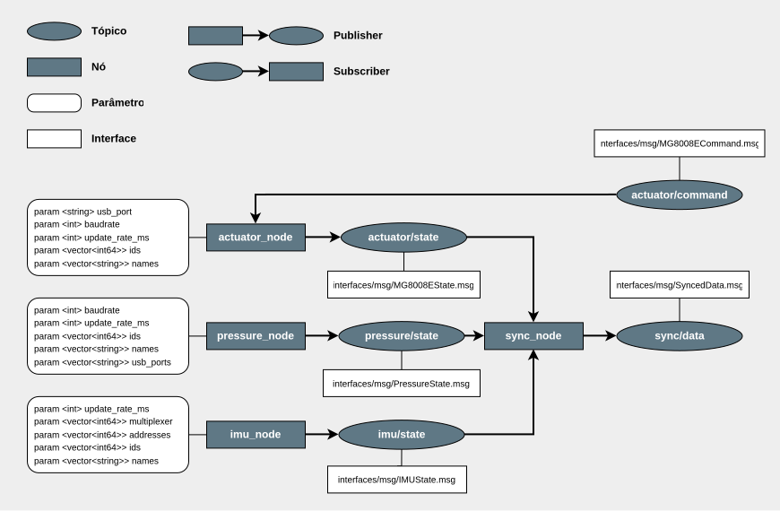

# ros2-sensorhub

## Arquitetura dos nós



## 🚀 Como executar
### 1. Acessar pasta de desenvolvimento
Entre na pasta onde residem os arquivos de configuração:
``` bash
cd dev
```

### 2. Iniciar o Docker
Execute o container (o ambiente será removido ao sair devido à flag --rm):
``` bash
sudo docker compose run --rm sensorhub
```

### 3. Configuração para Raspberry Pi 

> [!IMPORTANT]
> Caso esteja utilizando uma **Raspberry Pi**, execute os comandos abaixo **dentro do container** para garantir o acesso aos pinos via `wiringPi`:
``` bash
apt-get update && apt-get install -y git

cd /tmp && \
git clone https://github.com/WiringPi/WiringPi.git && \
cd WiringPi && \
./build && \
cd /app/ros2_ws
```

### 4. Compilação e Execução

Dentro do diretório do workspace (`/app/ros2_ws`), compile os pacotes e inicie o sistema:
``` bash
colcon build --symlink-install --executor sequential

source install/setup.bash

ros2 launch bringup base.launch.py
```

## ⚙️ Parâmetros

Os parâmetros dos pacotes são definidos via arquivos YAML localizados em `src/launch/config`.

### Actuator Node
Parâmetros referentes ao nó responsável pelo controle de dispositivos atuadores.
| Parâmetro | Descrição | Tipo
| :--- | :--- | :--- |
| `update_rate_ms` | Taxa de publicação dos dados (ms). | `int` |
| `usb_port` | Porta serial de conexão (ex: `/dev/ttyUSB0`). | `String` |
| `baudrate` | Velocidade da comunicação serial. | `int` |
| `names` | Lista de nomes amigáveis para os dispositivos. | `Array<String>` |
| `actuator_ids` | IDs físicos correspondentes aos nomes | `Array<int>`

### Pressure Node
Parâmetros do nó responsável pela leitura de sensores de pressão (palmilhas).

| Parâmetro | Descrição | Tipo |
| :--- | :--- | :--- |
| `update_rate_ms` | Taxa de publicação dos dados (ms). | `int` |
| `usb_ports` | Lista de portas seriais (uma para cada sensor). | `Array<String>` |
| `baudrate` | Velocidade da comunicação serial. | `int` |
| `ids` | IDs dos sensores conectados. | `Array<int>` |
| `names` | Lista de nomes para cada sensor. | `Array<String>` |


### IMU Node
Parâmetros do nó responsável pela leitura de Unidades de Medida Inercial (IMUs) via multiplexador.

| Parâmetro | Descrição | Tipo |
| :--- | :--- | :--- |
| `update_rate_ms` | Taxa de atualização das leituras (ms). | `int` |
| `ids` | Lista de identificadores para as IMUs. | `Array<int>` |
| `names` | Lista de nomespara os dispositivos. | `Array<String>` |
| `multiplexer` | Canal do multiplexador ao qual cada IMU está ligada. | `Array<int>` |
| `addresses` | Endereços I2C de cada sensor. | `Array<int>` |
